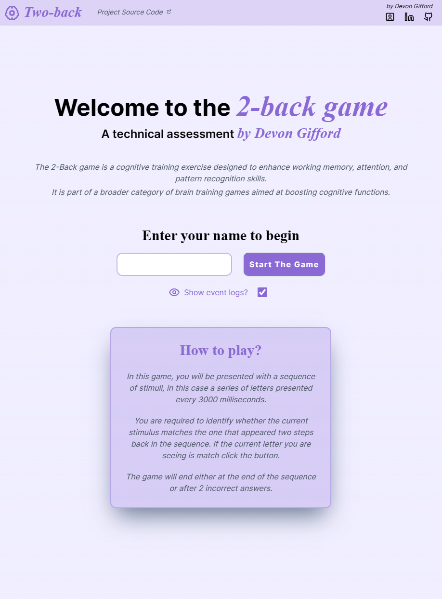
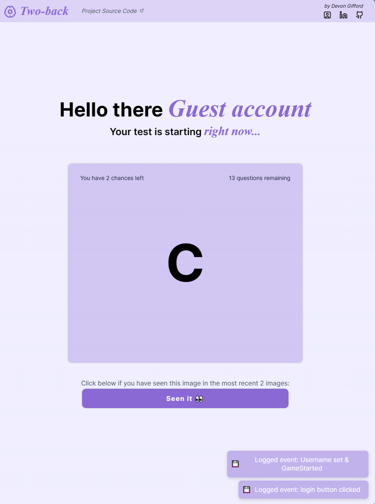
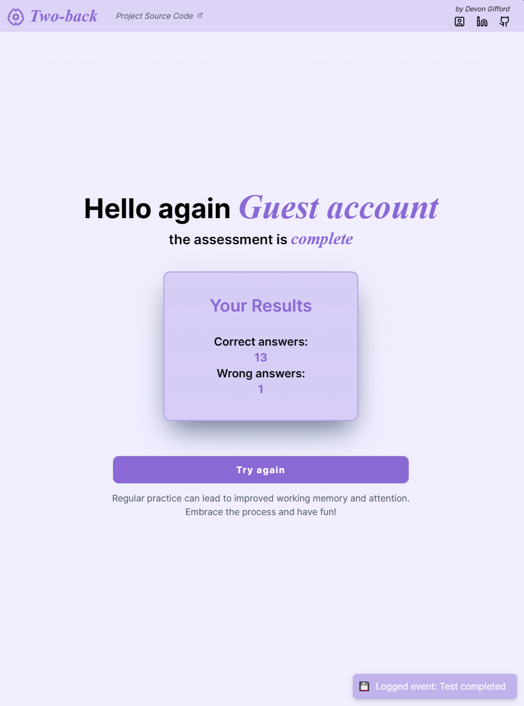

<!-- Introduction Text -->

    <h1>Take-Home Assaignment</h1>
    <h3>React app 2-Back Game  <h3>
    <h3> 
      <a href='https://n-game-technical-assignment.vercel.app/', target='_blank'>
        <h5>live demo</h5>
      <a/>
    </h3>
        <h6>
            built with <a href="https://nextjs.org/" >NextJS</a> &
            hosted by <a href="https://vercel.com/">Vercel</a> 
        </h6>

---

<h3 align='center'>
Tech Used in this Project
<h3>

    <a href="https://skillicons.dev">
         
        
        
    </a>

---

<!-- DEMO IMAGE  -->

    

 

<!-- -------------------------------------------------------------------------- -->

<h1 align='center'> Welcome & Introductory </h1>

<!-- -------------------------------------------------------------------------- -->

### Introduction:

<!-- -------------------------------------------------------------------------- -->

Build a gamified version of the 2-back task, which measures working memory.
The task involves presenting a sequence of letters and asking the user to identify if the current letter matches the one presented 2 trials before.

<h4><strong>⚠ Note for reviewer: </strong> </h4> 

🎯🎯🎯

<!-- -------------------------------------------------------------------------- -->
 

### 🔑 Key-Required Features of this project:

<!-- -------------------------------------------------------------------------- -->

#### REQUIRED FEATURES: 

✅  **Repository Setup & Version Control** 
<em>Setup GitHub with ReadMe</em>

✅  **User Interaction:** 
<em>Create a React app where the user can input their name before starting the 2-back task.</em>

✅  **Task Completion Conditions - end task after either:** 
<em>- two errors are made</em>  
<em>- a fixed number of letters are displayed (15)</em>

✅  **Event Logging:** 
<em>Capture user interactions as events, mimicking the interaction with an "event API" in the backend.</em>

✅  **Fully Responsive & Mobile Compatibility:**  
<em>Ensure that the UI is responsive and mobile-friendly.</em>

  

#### STRETCH FEATURES: 

✅  **Hosting App / Deployment:**  
<em>Deploy the solution online for easy testing.</em>

✅ **Error Handling and Form Validation:**  
<em>Implement proper error handling and validation to ensure the application handles edge cases gracefully.</em>

✅ **Unit & Integration Testing:**  
<em>If time allows, consider including unit tests or integration tests to verify the functionality of your code.</em>

 
<!-- -------------------------------------------------------------------------- -->

### 🎯 Known issues & potential improvements:  

<!-- -------------------------------------------------------------------------- -->
<!-- Small container -->

 Click here to expand

 

#### Known issues & Things I didn't have time for: 

💥  Implement a restriction to prevent users from clicking the same letter more than once per new stimulus, ensuring task integrity.

💥  Implement a system to accurately record instances where a user misses a correct answer.

💥  Establish a separate state for users who did not complete the test (DNF) due to more than two mistakes.

💥  Ensure that the same letter does not appear consecutively to enhance task validity.

💥  Improve Test Coverage and add E2E testing 
 

#### Future Features & Improvements: 

💥  Incorporate a brief interval between each letter presentation. Display the letter for a duration of 10 seconds, followed by a 10-second blank screen before transitioning to the next stimulus.

💥  Develop a comprehensive history feature to document correct answers for each instance a user provides an incorrect or missed response, enabling a detailed performance review.

💥  Integrate a user-friendly redirect mechanism on the /game and /results pages if no user is currently authenticated, providing a seamless user experience.

💥  Allow users to customize the game difficulty by enabling the transition between 2-back, 3-back, or 1-back modes (n-back), providing a tailored cognitive training experience.

💥  Introduce a timer display for each presented letter, enhancing user engagement and performance tracking.

💥  Provide immediate visual feedback for correct and incorrect answers, beyond a simple error count, to enhance the user's experience.

💥  Enhance the visual appeal and user experience of loading and error states to create a more engaging interface.

<!-- CLOSING DIV -->

<!-- SECTION CLOSING DIV -->

  