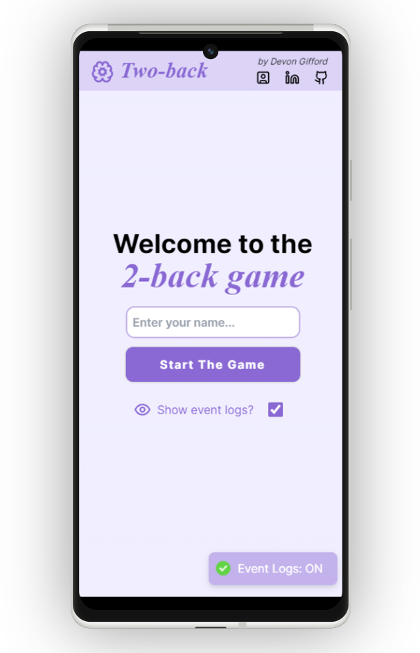
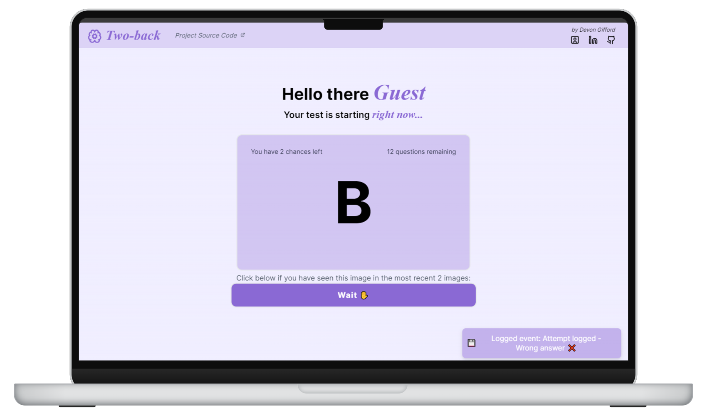

<!-- -------------------------------------------------------------------------- -->
<!-- HEADING STUFF  -->

  <h2>Take-Home Assessment</h2>
  <h4>Frontend NextJs app handeling 2-back memory game<h4>
  <h3> 
    <a href='https://n-game-technical-assignment.vercel.app/', target='_blank'>
      <h5>live demo ↗</h5>
    </a>
  </h3>
  

    <a href="https://github.com/DevonGifford/Thymia/issues">Report Bug</a>
    &nbsp;·&nbsp;
    <a href="https://github.com/DevonGifford/Thymia/issues">Request Feature</a>
    

<!-- -------------------------------------------------------------------------- -->

### 👋 Introduction:

---

The project involves creating a gamified version of the 2-back task, a cognitive test designed to measure working memory. In this task, users are presented with a sequence of letters and must determine if the current letter matches the one presented two trials before.

I chose Next.js for its built-in routing and used a global React context to manage state across components. The game operates with a random letter generator that progresses through intervals to present stimuli.  
Additionally, I implemented error logging, simulating post requests, and added a toggle function to display event logs as toast notifications.

 

<!-- -------------------------------------------------------------------------- -->
<!-- DEMO IMAGES  -->

 

<!-- -------------------------------------------------------------------------- -->

### 🔑 Assessment Requirements:

---

#### Required Features:

✔ **Repository Setup & Version Control**: Setup GitHub with ReadMe

✔ **User Interaction**: Create a React app allowing user name input before starting the 2-back task.

✔ **Task Completion Conditions**: End task after either three errors or displaying 15 letters.

✔ **Event Logging**: Capture user interactions as events, mimicking backend interaction.

✔ **Fully Responsive & Mobile Compatibility**: Ensure UI is responsive and mobile-friendly.

 

#### Bonus Features:

✔ **Hosting App / Deployment**: Deploy the solution online for easy reviewing.

✔ **Error Handling & Form Validation**: Implement error handling and validation for graceful edge case handling.

✔ **Unit & Integration Testing**: Include unit or integration tests if time allows.

   

<!-- -------------------------------------------------------------------------- -->

### 🎯 Known issues & potential improvements:

---

#### Known issues:

💥 Implement a separate state for users who did not complete the test (DNF) due to more than two mistakes.

💥 Global state is not persisted, page reloads will reset any global variables.

#### Potential improvements:

💥 Add brief blank intervals between each stimuli.

💥 Add timer display or countdown feature for each presented letter.

 

<!-- -------------------------------------------------------------------------- -->

(<a href="#readme-top">back to top</a>)

   
